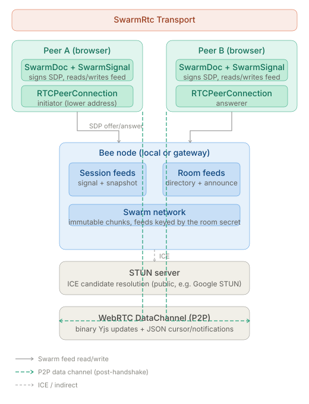
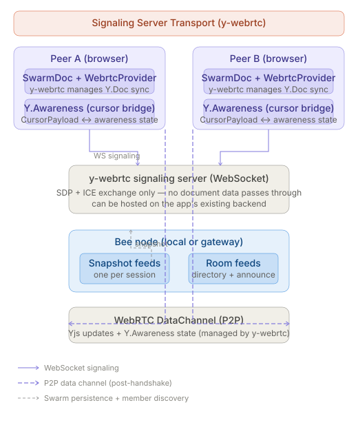

# swarm-collaborative-docs

Serverless, real-time collaborative document editing over [Swarm](https://ethswarm.org).

Each peer writes [Yjs](https://docs.yjs.dev) CRDT snapshots to their own Swarm feed and broadcasts incremental deltas
via a pluggable transport. Late-joining peers recover full document history by fetching Swarm snapshots; online peers
receive low-latency delta notifications. No central server is required for either persistence or synchronisation.

All data written to Swarm is **immutable at the chunk level** — every upload produces a new content address. Feeds are
Swarm's mechanism for publishing a pointer to the latest snapshot; the underlying chunks are never overwritten. This is
a core property of the Swarm network and shapes how this library approaches storage.

---

## How it works

### Data layers

| Layer                  | Mechanism                                              | Purpose                                                            |
| ---------------------- | ------------------------------------------------------ | ------------------------------------------------------------------ |
| **Document snapshot**  | Per-session Swarm feed (`<topic>_doc<sessionAddress>`) | Durable, offline-accessible full state                             |
| **Delta notification** | Transport-dependent (see below)                        | Fast sync for peers already online                                 |
| **Member discovery**   | Shared Swarm feed (`<topic>_members`)                  | One approach to a persistent peer list — alternatives are possible |
| **WebRTC signaling**   | Per-session Swarm feed (`<topic>_signal`)              | SDP exchange without a dedicated signaling server (SwarmRtc only)  |

### Document lifecycle

1. **Init** — each peer reads its own latest snapshot from Swarm and restores local Yjs state.
2. **Member list** — the peer writes itself to the shared consensus feed, then fetches snapshots from all listed peers.
3. **Join announcement** — a `JoinPayload` (`type: 'join'`) is published so online peers know to fetch the new peer's
   snapshot.
4. **Local edits** — Yjs `update` events are debounced, merged into a snapshot, written to the peer's Swarm feed, and
   broadcast as a signed delta via the transport.
5. **Remote updates (delta path)** — when a notification carrying a `delta` arrives, the secp256k1 signature is verified
   and the base64-encoded Yjs update is applied directly — no Swarm read required. Unsigned or invalid deltas are
   dropped.
6. **Remote updates (snapshot path)** — for join events or notifications without a delta, the peer's full snapshot is
   fetched from Swarm with retries.
7. **Cursor awareness** — cursor positions are broadcast on a debounced timer via `CursorPayload` (`type: 'cursor'`) and
   surfaced to subscribers via `DOC_EVENTS.AWARENESS_UPDATED`.

---

## Swarm storage design

### Immutability and feeds

Every piece of data uploaded to Swarm produces a unique, content-addressed chunk that is **immutable by design** — it
cannot be modified or deleted after upload. Swarm feeds are a layer on top of this: a feed is a signed, sequentially
indexed series of pointers, each pointing to a new immutable upload. The feed address is stable; what it points to
changes with each new entry.

This library uses feeds for document snapshots and signaling records. Each time a peer saves a snapshot, a new set of
immutable chunks is uploaded and the feed index is advanced to point at them. Previous snapshots remain accessible at
their original content addresses for as long as the underlying chunks are covered by a valid postage stamp.

### Postage stamps and storage lifetime

Swarm storage is paid for through **postage stamp batches** — on-chain commitments that authorise uploads and determine
how long chunks persist in the network.

This library's `stamp` setting accepts any postage stamp batch ID the application provides. How batches are purchased,
renewed, and distributed across users is entirely the responsibility of the consuming application. Common patterns
include:

- **Per-user batches** — each user purchases and manages their own postage stamp batch. Maximally decentralised; each
  peer owns their data.
- **App-provisioned batches** — the application provisions a shared batch and distributes write access. Simpler UX but
  introduces a centralised cost bearer.
- **Sponsored batches** — a third party (the app operator, a DAO) covers storage costs on behalf of users.

There is no single correct answer — the right model depends on the application's trust assumptions and economic design.

### Member discovery and peer lists

The `<topic>_members` consensus feed used by this library is **one approach** to peer discovery, not a requirement. It
works well for small, known groups where all members write to a shared namespace. Applications are free to replace or
extend it entirely — for example using ENS records, a smart contract registry, a curated invite list, or any other
mechanism that can resolve a set of Ethereum addresses.

The `members` field in `DocSettings` takes a map of identity address to username. These are **display hints**, not a
replacement for discovery: an identity address alone cannot address a peer's feeds, because those are keyed by session
address (see [Sessions](#sessions)). The library resolves session addresses from the consensus feed and from `join`
notifications, and uses a hint to label a peer whose entry carries no username.

```typescript
const knownPeers = new Map([
  ['a1b2c3...', 'Alice'],
  ['d4e5f6...', 'Bob'],
])

const settings: DocSettings = {
  ...
  infra: {
    ...
    members: knownPeers, // names for identities you already know
  },
}
```

---

## Architecture


### Per-transport infrastructure

Each diagram shows the full infrastructure picture for a single transport — peers, Swarm components, external services,
and data paths.





## Transport data flows

Step-by-step flow comparison for peer discovery, connection setup, doc sync, snapshot persistence, and cursor awareness.


---

## Monaco Editor integration

The example app uses [Monaco Editor](https://github.com/microsoft/monaco-editor) (the VS Code editing engine) as its
primary editor, bound to the shared `Y.Doc` via [`y-monaco`](https://github.com/yjs/y-monaco).

### How it is wired

```
Y.Doc  ──  MonacoBinding (y-monaco)  ──  Monaco ITextModel  ──  editor UI
               │
         awareness map
               │
         deltaDecorations()  ──  remote cursor overlays
```

The `MonacoBinding` keeps the Monaco model and the `Y.Text` in sync bidirectionally. It is created once the `Y.Doc` is
available and destroyed on unmount:

```tsx
const ytext = yDoc.getText(filePathKey) // keyed by file path, default: 'content'

bindingRef.current = new MonacoBinding(
  ytext,
  editor.getModel(),
  new Set([editor]),
  undefined, // awareness passed manually — see below
)
```

### Workers

Monaco spawns Web Workers for language services. Because `vite-plugin-monaco-editor` is incompatible with Vite 6+,
workers are configured manually via `MonacoEnvironment`:

```ts
// src/app/components/MonacoEditor/workers.ts
// import this file before any monaco-editor import
import EditorWorker from 'monaco-editor/esm/vs/editor/editor.worker?worker'
import TsWorker from 'monaco-editor/esm/vs/language/typescript/ts.worker?worker'

window.self.MonacoEnvironment = {
  getWorker(_: unknown, label: string) {
    if (label === 'typescript' || label === 'javascript') return new TsWorker()
    return new EditorWorker()
  },
}
```

### Remote cursor rendering

`y-monaco`'s built-in awareness path is not used here because the library surfaces cursor state through its own
`DOC_EVENTS.AWARENESS_UPDATED` event rather than exposing a `Y.Awareness` instance. The same applies to CodeMirror:
`yCollab(ytext, null)` from `y-codemirror.next` accepts a null awareness and works fine, with remote cursors drawn by
the application from `AWARENESS_UPDATED`. Cursors are rendered manually using Monaco's decoration API:

- `useSwarmDoc` returns `awareness: Map<string, AwarenessState>` — a map of peer address →
  `{ address, username, cursor: { anchor, head } | null }`.
- `MonacoEditor` listens to that map via a `useEffect([awareness])` and calls `editor.deltaDecorations()` on every
  change.
- Peer-specific CSS classes (`.remote-selection-<id>`, `.remote-cursor-head-<id>`) are injected into `<head>` on first
  appearance with a deterministic color derived from the peer's address.
- Local cursor changes are reported back via `onDidChangeCursorSelection` → `updateCursor({ anchor, head })`.

### Multi-file support

Each open file maps to a named `Y.Text` key inside the shared `Y.Doc`:

```ts
yDoc.getText('contracts/MyToken.sol')
yDoc.getText('scripts/deploy.ts')
```

Pass the file path as the `filePathKey` prop to `MonacoEditor`. All open files share the same Swarm transport session —
no extra connections are needed.

Cursors carry the same key as `CursorPosition.scope`, so a peer's caret in `contracts/MyToken.sol` is not drawn at the
same offsets in whatever file the receiver happens to have open. Report it with the local cursor and skip any remote
state whose `scope` is set and does not match the editor's own key:

```typescript
onCursorChange({ anchor, head, scope: filePathKey })
```

Omit `scope` in a single-text document; a receiver treats an absent scope as "the default text".

### Alternative: `@monaco-editor/react`

Some applications use [`@monaco-editor/react`](https://github.com/suren-atoyan/monaco-react) instead of importing
`monaco-editor` directly. This package is a React wrapper that lazy-loads Monaco at runtime rather than bundling it at
build time, and manages the editor instance lifecycle as a declarative component.

The key difference is how Monaco is loaded:

```ts
loader.config({ paths: { vs: 'assets/js/monaco-editor/min/vs' } })
```

Because Monaco is loaded via the browser's script loader rather than Vite, there is no need for `MonacoEnvironment`,
`?worker` imports, or any bundler plugin. Workers are resolved automatically from the same `vs/` path.

The `MonacoBinding` wiring is identical — you receive the same editor instance via the `onMount` callback and bind it to
`Y.Text` exactly as before.

This approach is preferable when Monaco is already served as a static asset by the host application, avoiding a
duplicate bundled copy. The cursor rendering and awareness logic described above applies unchanged regardless of which
loading approach is used.

---

## Library API (`src/lib`)

### Installation

```bash
npm install @solarpunkltd/swarm-collaborative-docs yjs
```

`yjs` is a peer dependency and is deliberately **not** bundled: an editor binding such as `y-monaco`,
`y-codemirror.next` or `y-prosemirror` imports Yjs itself, and two Yjs instances in one page do not recognise each
other's relative positions and types. Your application must provide the single copy both sides share. The same applies
to `@ethersphere/bee-js`, which the library also keeps external.

`y-webrtc` is an **optional** peer dependency, needed only by `createSignalingServerTransport`. It is loaded through a
dynamic `import()` at transport start, so an application on `createSwarmRtcTransport` never bundles it:

```bash
npm install y-webrtc # only if you use createSignalingServerTransport
```

The package is ESM-first (`"type": "module"`) and ships `.mjs`, `.cjs` and type declarations. Supported toolchains are
bundlers (`moduleResolution: "bundler"`) and Node ≥ 22.12.

### `SwarmDoc`

The primary class. Manages a Yjs document backed by Swarm and a pluggable transport.

```typescript
import { SwarmDoc, DocSettings, DOC_EVENTS, createSwarmRtcTransport } from '@solarpunkltd/swarm-collaborative-docs'
import * as Y from 'yjs'

const settings: DocSettings = {
  user: {
    privateKey: '0xabc...', // secp256k1 private key, hex with or without 0x
    nickname: 'Alice',
    sessionId: crypto.randomUUID(), // optional; one per tab — see below
  },
  infra: {
    beeUrl: 'http://localhost:1633',
    stamp: 'your-postage-batch-id', // required — see Postage stamps
    topic: 'my-document-id', // UUID recommended
    transport: createSwarmRtcTransport({
      iceServers: [{ urls: 'stun:stun.l.google.com:19302' }],
    }),
  },
}

const swarmDoc = new SwarmDoc(settings)

swarmDoc.getEmitter().on(DOC_EVENTS.DOC_UPDATED, (doc: Y.Doc) => {
  /* re-render */
})
swarmDoc.getEmitter().on(DOC_EVENTS.MEMBERS_UPDATED, (members: Map<string, MemberEntry>) => {
  /* update peer list */
})
swarmDoc.getEmitter().on(DOC_EVENTS.DOC_READY, () => {
  /* enable editor — init finished, with or without peers */
})
swarmDoc.getEmitter().on(DOC_EVENTS.PEERS_CONNECTED, () => {
  /* show "live" — at least one remote peer is connected */
})
swarmDoc.getEmitter().on(DOC_EVENTS.DOC_ERROR, (err: Error) => {
  /* show error */
})
swarmDoc.getEmitter().on(DOC_EVENTS.AWARENESS_UPDATED, (state: AwarenessState) => {
  /* update cursors */
})

swarmDoc.start()

// bind an editor directly to the shared Y.Text
const text = swarmDoc.doc.getText('content')

// before the page unloads — snapshot writes are debounced and would otherwise be lost
window.addEventListener('beforeunload', () => {
  swarmDoc.flush()
})

// later
swarmDoc.stop()
```

#### Public members

| Member                 | Type            | Description                                                      |
| ---------------------- | --------------- | ---------------------------------------------------------------- |
| `doc`                  | `Y.Doc`         | The shared Yjs document. Bind editors directly to this instance. |
| `start()`              | `void`          | Starts transport, fetches snapshots, begins member polling.      |
| `stop()`               | `void`          | Tears down transport and all timers.                             |
| `flush()`              | `Promise<void>` | Publishes queued edits now and resolves once they are on Swarm.  |
| `updateCursor(cursor)` | `void`          | Reports local cursor `{ anchor, head, scope? }` (or `null`).     |
| `getEmitter()`         | `EventEmitter`  | Returns the emitter for `DOC_EVENTS` subscriptions.              |
| `refreshMemberList()`  | `Promise<void>` | Force-reads the consensus member list and registers new peers.   |

### `DocSettings`

```typescript
interface DocSettings {
  user: {
    privateKey: string // secp256k1, hex with or without 0x
    nickname: string
    sessionId?: string // one per tab; defaults to a random UUID
  }
  infra: {
    beeUrl: string // e.g. 'http://localhost:1633'
    stamp: string // required — postage batch for all Swarm writes
    topic: string // shared document identifier
    members?: Map<string, string> // display hints: Map<identity address, username>
    transport: DocTransportFactory // required — no default, pick one explicitly
  }
}
```

`stamp` is validated against the Bee node during `start()`. A missing, unknown, unusable or exhausted batch raises
`DOC_ERROR` with the reason rather than failing silently at the first write. Every participant writes their own feeds,
so every participant needs a usable batch on the node their `beeUrl` points at — see
[Postage stamps and storage lifetime](#postage-stamps-and-storage-lifetime).

#### Sessions

The same identity can be open in more than one place at once — a second tab, a second device, a restored browser
session. Each of those needs its own `sessionId`, because a session's Swarm feeds are addressed by a **session address**
derived from `privateKey` and `sessionId` together. Two sessions sharing one id would write the same feeds with
independent index counters and silently overwrite each other.

Persist the id in `sessionStorage`: it is per tab, and it survives a reload, so a refresh rejoins the same session
instead of leaving the previous one behind.

```typescript
function getOrCreateSessionId(): string {
  const existing = sessionStorage.getItem('session_id')

  if (existing) return existing

  const sessionId = crypto.randomUUID()
  sessionStorage.setItem('session_id', sessionId)

  return sessionId
}
```

Peers are therefore keyed by session address, not by identity. Each `MemberEntry` carries the `identity` address behind
it, so a UI can group a person's sessions into one row:

```typescript
interface MemberEntry {
  username: string
  identity: string // identity address — shared by all of that user's sessions
  sessionId: string
  lastSeen: number
  live: boolean // false once the session shut down; its snapshots are still read, it is never dialled
}
```

#### Tunables

Fixed in the current version: a 500 ms debounce before a local edit is written to Swarm (`flush()` bypasses it), a 5 s
poll of the consensus member list, a 15 s poll of the snapshot feeds of members with no open channel, and — in
`createSwarmRtcTransport` — a 2 s signal-feed poll, a 15 s connect timeout before a stalled `RTCPeerConnection` is
renegotiated, and a 60 s staleness window on SDP records.

All feed reads use explicit indices. Asking Bee for a feed's _latest_ update triggers a network search that is slow and
whose misses are cached, so a record can stay invisible for tens of seconds after it was written — long enough to stall
a WebRTC handshake past the point where DTLS still completes.

A single postage stamp covers all Swarm writes made by this session: document snapshots, delta notifications, WebRTC
signal records, and the consensus member list. The `stamp` field accepts any valid postage batch — how stamps are
provisioned and managed is left to the application. See
[Swarm postage stamps](https://docs.ethswarm.org/docs/learn/technology/contracts/postage-stamp) for details on capacity
and TTL.

The connection mesh is full: with _N_ participants each peer holds _N−1_ data channels and, on SwarmRtc, polls _N−1_
signal feeds every 2 s against one Bee node. That is comfortable for small groups and has not been tuned beyond them —
expect to revisit the poll interval before running sessions much larger than a handful of peers.

### `DOC_EVENTS`

| Event                           | Payload                        | When                                                     |
| ------------------------------- | ------------------------------ | -------------------------------------------------------- |
| `DOC_EVENTS.DOC_UPDATED`        | `Y.Doc`                        | After every remote update is applied                     |
| `DOC_EVENTS.DOC_ERROR`          | `Error`                        | Stamp validation failure or publish error                |
| `DOC_EVENTS.DOC_READY`          | `{ memberCount: number }`      | Init finished — safe to edit, with or without peers      |
| `DOC_EVENTS.TRANSPORT_READY`    | `true`                         | Transport's own channel is usable; says nothing of peers |
| `DOC_EVENTS.MEMBERS_UPDATED`    | `Map<string, MemberEntry>`     | Peer list changes (session address → entry)              |
| `DOC_EVENTS.PEERS_CONNECTED`    | `true`                         | At least one **remote** peer connected                   |
| `DOC_EVENTS.PEER_STATE_UPDATED` | `Map<string, PeerConnection…>` | A peer's live connection state changed                   |
| `DOC_EVENTS.AWARENESS_UPDATED`  | `AwarenessState`               | Remote cursor position changed                           |
| `DOC_EVENTS.WRITE_PENDING`      | `true`                         | Local edits queued but not yet written to Swarm          |
| `DOC_EVENTS.WRITE_DONE`         | `true`                         | Every queued local edit has been written                 |

Gate an editor on `DOC_READY`, not on `PEERS_CONNECTED` — the latter never fires for a lone peer, which is the normal
state of the first person to open a document.

`PEER_STATE_UPDATED` is what to draw a per-peer "live" indicator from: `PeerConnectionState.Connected` means a data
channel is open with that session, `Registered` means it is known from the consensus feed and reachable only through
Swarm.

`WRITE_PENDING` / `WRITE_DONE` bracket the debounce-and-write window. Pair them with `flush()` to warn before an unload
rather than guessing at a timeout.

`AwarenessState` shape:
`{ address: string, identity: string, username: string, cursor: { anchor: number, head: number, scope?: string } | null }`.

### Interfaces

The library exports TypeScript interfaces for each major class, useful for testing and dependency injection:

| Interface   | Implemented by | Description                                 |
| ----------- | -------------- | ------------------------------------------- |
| `ISwarmDoc` | `SwarmDoc`     | Public API of the collaborative doc session |
| `IMembers`  | `Members`      | Peer set management and consensus feed      |

### Exported surface

The entry point is deliberately small — everything below is public API, and nothing else is reachable:

**Values** — `SwarmDoc`, `DOC_EVENTS`, `PeerConnectionState`, `createSwarmRtcTransport`,
`createSignalingServerTransport`, `validateStamps`, `uuidV4`.

**Types** — `DocSettings`, `SwarmRtcOptions`, `SignalingServerOptions`, `DocTransport`, `DocTransportDeps`,
`DocTransportFactory`, `ISwarmDoc`, `IMembers`, `MemberEntry`, `CursorPosition`, `NotificationPayload`,
`NotificationHandler`, `JoinPayload`, `DocPayload`, `CursorPayload`, `LeavePayload`.

Internals (`DocFeed`, `Members`, `SwarmSignal`, key derivation helpers) are not exported: they are implementation detail
and their signatures change without a major bump.

---

## Transports

Two transports are shipped. Each implements `DocTransport` and is passed to `DocSettings.infra.transport` as a factory.
Both fall back to Swarm snapshot reads for document history recovery, so a peer that was offline still converges.

**There is no default transport and no default server.** Both factories take an options object and throw immediately if
a required field is missing or carries the wrong URL scheme — a `stun:` URL passed as `signalingUrl`, or a `ws://` URL
passed in `iceServers`, is rejected at construction with a message saying which field it belongs in. Connectivity is
always a deliberate choice, never an inherited default that silently points at a server nobody runs.

### `createSwarmRtcTransport` ✓ recommended

**Best for**: fully decentralised peer-to-peer sync with no server to operate beyond a Bee node.

SDP offer/answer records are written to and read from each session's `<topic>_signal` Swarm feed, replacing the
signaling server. Role assignment is deterministic (lower session address = initiator) to avoid duplicate connections.
On ICE failure the initiator retries, giving up after a bounded number of attempts so a reloaded session is not dialled
forever.

Yjs binary updates and JSON `NotificationPayload` messages (including cursor) share the same WebRTC DataChannel: binary
frames are Yjs updates, string frames are JSON payloads.

```typescript
import { createSwarmRtcTransport } from '@solarpunkltd/swarm-collaborative-docs'

transport: createSwarmRtcTransport({
  iceServers: [
    { urls: 'stun:stun.l.google.com:19302' },
    { urls: 'turn:turn.example.com:3478', username: '…', credential: '…' },
  ],
})
```

| Option       | Type             | Required | Notes                                                                                        |
| ------------ | ---------------- | :------: | -------------------------------------------------------------------------------------------- |
| `iceServers` | `RTCIceServer[]` |    ✓     | STUN suffices when one side is directly reachable; symmetric NAT needs TURN with credentials |

When a data channel opens, the two sides exchange Yjs state vectors and reply with only the updates the other lacks,
rather than each pushing its whole document. Losing one direction of that exchange is self-correcting.

**Delivery**: WebRTC DataChannel (peer-to-peer). Requires a Bee node for signaling feed reads and writes. Needs no extra
npm package.

---

### `createSignalingServerTransport`

**Best for**: lower connection-setup latency when you already operate a WebSocket server.

Uses [y-webrtc](https://github.com/yjs/y-webrtc). Peers are discovered through the `Y.Awareness` protocol over a
signaling server **you run** — the signaling server only relays SDP and ICE candidates, no document data. Yjs state is
synchronised over WebRTC data channels managed by y-webrtc, and cross-tab sync within one origin is handled
automatically via BroadcastChannel.

Cursor state is bridged into `DOC_EVENTS.AWARENESS_UPDATED`: `publish(CursorPayload)` sets
`awareness.setLocalStateField('cursor', …)`, and incoming awareness changes are forwarded to the notification handler as
`CursorPayload`.

```typescript
import { createSignalingServerTransport } from '@solarpunkltd/swarm-collaborative-docs'

transport: createSignalingServerTransport({
  signalingUrl: 'wss://your-app.example/collab-signal',
  iceServers: [{ urls: 'stun:stun.l.google.com:19302' }],
})
```

| Option         | Type             | Required | Notes                                                          |
| -------------- | ---------------- | :------: | -------------------------------------------------------------- |
| `signalingUrl` | `string`         |    ✓     | `ws://` or `wss://` URL of a y-webrtc signaling server you run |
| `iceServers`   | `RTCIceServer[]` |    ✓     | Same as above                                                  |

Run the signaling server yourself — y-webrtc ships one (`npx y-webrtc-signaling`, or the `bin/server.js` in its
repository), and it is a few lines to mount inside an existing WebSocket server. There is no public default: pointing at
a server that does not exist is the single most common way a session appears to start and then never connects.

`y-webrtc` must be installed. It is resolved by dynamic `import()` on `start()`, so a missing package surfaces as a
`DOC_ERROR` telling you to install it or switch transport, rather than breaking your build.

**Delivery**: WebRTC data channels. Does not require a Bee node for signaling, but still uses one for snapshots and the
member list.

---

## Transport comparison

|                          | SwarmRtc ✓ | Signaling server |
| ------------------------ | :--------: | :--------------: |
| No server to operate     |     ✓      |        ✗         |
| Requires Bee node        |     ✓      |   for storage    |
| Requires STUN/TURN       |     ✓      |        ✓         |
| Extra npm package        |     ✗      |    `y-webrtc`    |
| Connection setup latency |  seconds   |    sub-second    |
| Cursor awareness         |     ✓      |        ✓         |
| Offline recovery         |    ✓\*     |       ✓\*        |

\*via Swarm snapshot reads — both transports share the same persistence layer regardless of notification delivery.

Pick **SwarmRtc** unless you already run a WebSocket server and need the faster handshake; pick **SignalingServer** when
you do.

---

## Unshipped transports

`src/experimental/` holds two further transports as reference implementations. They are **not exported, not built and
not supported** — no entry point reaches them, and their dependencies are not declared:

- **`swarmPubSubTransport.ts`** — Swarm GSOC ephemeral pubsub over the Bee WebSocket endpoint. Needs a Bee build from a
  development branch and a bee-js exposing `pubsubConnect`; neither is in a stable release.
- **`wakuTransport.ts`** — [Waku](https://waku.org) light node via LightPush and Filter. Works, but delivery depends on
  the public Waku sandbox network and has had no reliability work.

Both are written against the same `DocTransport` interface, so they are a starting point if you want to add a transport
of your own. Copy the file into your project and declare the dependency there — do not expect the library to keep them
compiling.

---

## Deploying behind a gateway

Some applications serve their frontend through a web gateway rather than having users run a local Bee node directly.
[Remix IDE](https://remix.ethereum.org) is a representative example: it is a web app hosted at a public URL, and its
users access it through a browser without running any local infrastructure.

In this deployment pattern the Swarm persistence layer (snapshot feeds, member list, signal feeds) is accessed via a
**Bee gateway** — a publicly reachable Bee node that the app points its `beeUrl` at. The gateway handles all Swarm reads
and writes on behalf of the user; the user's private key stays in the browser and signs feed updates locally before they
are submitted.

### Transport selection for gateway deployments

The transport choice is constrained by what the hosting application can provide:

**`createSignalingServerTransport` — recommended for gateway-hosted apps**

When the hosting application already runs a WebSocket server (as Remix does for its backend services), that server can
trivially host a [y-webrtc signaling endpoint](https://github.com/yjs/y-webrtc#signaling). This requires adding a single
lightweight signaling handler to the existing server — no separate infrastructure. The signaling server only exchanges
SDP and ICE candidates; no document data passes through it.

```typescript
// the app's existing backend serves the signaling endpoint
transport: createSignalingServerTransport({
  signalingUrl: 'wss://your-app.example/collab-signal',
  iceServers: [{ urls: 'stun:stun.l.google.com:19302' }],
})
```

Peer-to-peer WebRTC data channels are established after signaling, so document content and cursor data flow directly
between peers. Swarm feeds (via the gateway Bee node) provide persistence and offline recovery exactly as in any other
deployment.

**`createSwarmRtcTransport` — works without any server**

If the hosting application cannot provide a signaling server, `SwarmRtcTransport` uses Swarm feeds for SDP exchange via
the gateway Bee node. No additional server is required. The trade-off is higher connection setup latency compared to a
WebSocket signaling server, since SDP negotiation goes through Swarm feed reads and writes.

```typescript
transport: createSwarmRtcTransport({ iceServers: [{ urls: 'stun:stun.l.google.com:19302' }] })
```

### Gateway deployment architecture

```
Browser (user)
    │
    ├── Swarm reads/writes ──► Bee gateway (public HTTPS)
    │                               │
    │                               └── Swarm network
    │
    └── WebRTC signaling ──► App signaling server (WS)
            │
            └── WebRTC DataChannel (P2P, post-handshake)
                    │
                 Remote peer browser
```

Every peer writes — its own snapshot feed, and its signal feed on SwarmRtc — so every peer needs a usable postage stamp
on the node its `beeUrl` names. There is no read-only participant mode. Either the app provisions a shared stamp for all
users, or each user brings their own; see [Swarm storage design](#swarm-storage-design) for the trade-offs.

### Serving over HTTPS

A page served over `https://` cannot make requests to an `http://` Bee node — the browser blocks them as **mixed
content** before any CORS header is consulted, so a permissive `Access-Control-Allow-Origin: *` on the node changes
nothing. `http://127.0.0.1:1633` and `http://localhost:1633` are the exception: browsers treat loopback as a
potentially-trustworthy origin and allow it, which is why a local Bee node works from an HTTPS page and a remote one
does not.

Point `beeUrl` at an `https://` endpoint: terminate TLS in front of the Bee node (a reverse proxy with a certificate is
enough) and let that proxy set the CORS headers. A `net::ERR_BLOCKED_BY_CLIENT`-style failure with a working `curl` from
the same machine is nearly always this and not a CORS misconfiguration.

---

## React hook (`useSwarmDoc`)

Convenience hook for React applications. Manages the `SwarmDoc` lifecycle, re-renders on events, and cleans up on
unmount.

```typescript
import { useSwarmDoc } from './hooks/useSwarmDoc'

const { doc, error, members, ready, connected, awareness, updateCursor, flush, refreshMemberList, dismissError } =
  useSwarmDoc({ user, infra })
```

| Returned value         | Type                               | Description                                 |
| ---------------------- | ---------------------------------- | ------------------------------------------- |
| `doc`                  | `Y.Doc \| null`                    | The Yjs document (null before init)         |
| `error`                | `Error \| null`                    | Latest error, or null                       |
| `members`              | `Map<string, MemberEntry> \| null` | Known peers: session address → entry        |
| `peerStates`           | `Map<string, PeerConnectionState>` | Live connection state per session address   |
| `ready`                | `boolean`                          | Init finished — gate the editor on this     |
| `connected`            | `boolean`                          | At least one remote peer has a live channel |
| `awareness`            | `Map<string, AwarenessState>`      | Live cursor state per session address       |
| `updateCursor(cursor)` | `(cursor) => void`                 | Reports local cursor position for broadcast |
| `flush()`              | `() => Promise<void>`              | Writes queued edits to Swarm now            |
| `refreshMemberList()`  | `() => void`                       | Triggers an immediate member list refresh   |
| `dismissError()`       | `() => void`                       | Clears the current error                    |

---

## Example app (`src/app`)

A minimal test application demonstrating all transport options with a shared editor.

### Running locally

```bash
pnpm install
pnpm start
```

The app runs at `http://localhost:5002`.

### Login screen

- **Document ID** — UUID identifying the shared document, auto-generated and persisted in `localStorage`. An invite link
  (`?doc=<id>&trans=<transport>`) pre-fills this field.
- **Transport tabs** — Swarm-signalled WebRTC or signaling server.
- **Advanced settings** (collapsible) — STUN/TURN server URL, signaling server URL (signaling-server transport only),
  Bee API URL, postage batch ID. The STUN/TURN URL and the postage batch are required; the login form refuses to
  continue without them.

### Session screen

- Shared editor (Monaco or plain textarea fallback) bound to the shared `Y.Text`
- Remote peer cursors rendered as colored overlays with username badges
- Peer list showing connected members (hover for full address, click to copy)
- Transport badge showing the active transport

---

## Future improvements

### End-to-end encryption

Currently all document snapshots and deltas are stored and transmitted in plaintext. Anyone with access to the Swarm
feed address and a Bee node can read the content. Two complementary approaches are planned:

**Client-side encryption** — encrypt the `Y.Doc` snapshot bytes in the browser before uploading to Swarm, and decrypt
after fetching. The encryption key would be derived from a shared secret negotiated between session participants (e.g.
via ECDH over their Ethereum keys) and never leave the browser. This protects content at rest from any observer with
access to the Swarm network, including the Bee gateway operator.

**Swarm ACT (Access Control Trie)** — Swarm's native access control layer allows uploads to be encrypted such that only
designated grantees can decrypt them, with access managed on-chain via a publisher/history address scheme. Integrating
ACT would allow document access to be granted and revoked per-peer without re-encrypting the full history, and makes
encryption verifiable at the storage layer rather than relying solely on application-level key management.

These two approaches are not mutually exclusive — client-side encryption provides an additional layer of protection for
content in transit and at rest locally, while ACT governs who can decrypt content retrieved from Swarm.

---

### Wallet-based identity and decoupled user keys

The current implementation derives the user's identity from a raw secp256k1 private key passed directly to
`DocSettings.user.privateKey`. This couples the user's signing key to the application and requires the application to
manage key material directly — a security risk and a poor user experience.

Several improvements are planned:

**Wallet connection (MetaMask and EIP-1193 providers)** — instead of accepting a raw private key, the library would
accept any [EIP-1193](https://eips.ethereum.org/EIPS/eip-1193)-compatible provider (MetaMask, WalletConnect, Coinbase
Wallet, etc.). The user's Ethereum account would be used for signing feed updates and delta payloads without the private
key ever being exposed to the application. This also gives users a consistent identity across applications — the same
Ethereum address they use for on-chain interactions identifies them in collaborative sessions.

```typescript
// future API sketch
const settings: DocSettings = {
  user: {
    provider: window.ethereum, // any EIP-1193 provider, replaces privateKey
    nickname: 'Alice',
  },
  ...
}
```

**Decoupled identity from the Bee node** — currently the library's signing key is implicitly tied to the Bee node
configuration. Separating user identity from the Bee node means a user can point the application at any Bee gateway
(their own, a public one, or an app-provisioned one) without that gateway having any relationship to their Ethereum
identity. Feed updates would be signed client-side and submitted to whichever node the application is configured with.

**Authenticated session keys** — feed writes are already signed by a per-session key derived from the identity key (see
[Sessions](#sessions)), so the main key is not used for high-frequency signing. What is still missing is proof of the
link: a session claims its `identity` in the member list and nothing verifies that claim. Having the identity key sign
the session address once, and carrying that signature in the member entry, would make the grouping trustworthy — and is
the natural shape for a wallet-issued delegation once identity moves to an EIP-1193 provider.

---

### Persistent session and presence

A user's online/offline status, active document, and last-seen time currently exist only in the ephemeral transport
layer (awareness state) and are lost when the session ends. Persisting presence information to a per-user Swarm feed
would enable asynchronous collaboration workflows — seeing who last edited a document, when, and from which peer —
without requiring all participants to be online simultaneously. This would build naturally on top of the wallet identity
work above, since a stable Ethereum address is the natural key for a persistent presence record.

## License

[Apache-2.0](./LICENSE)
