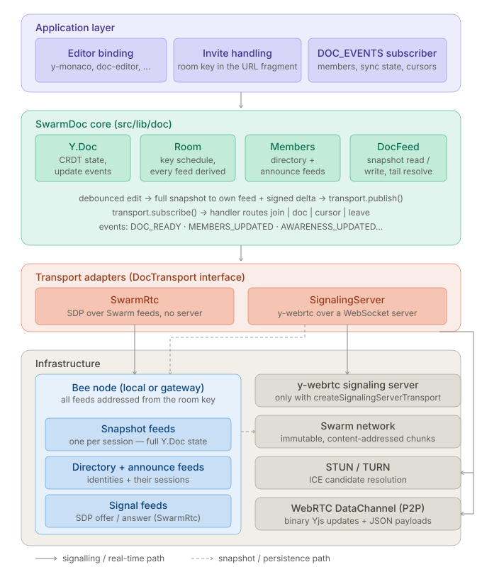
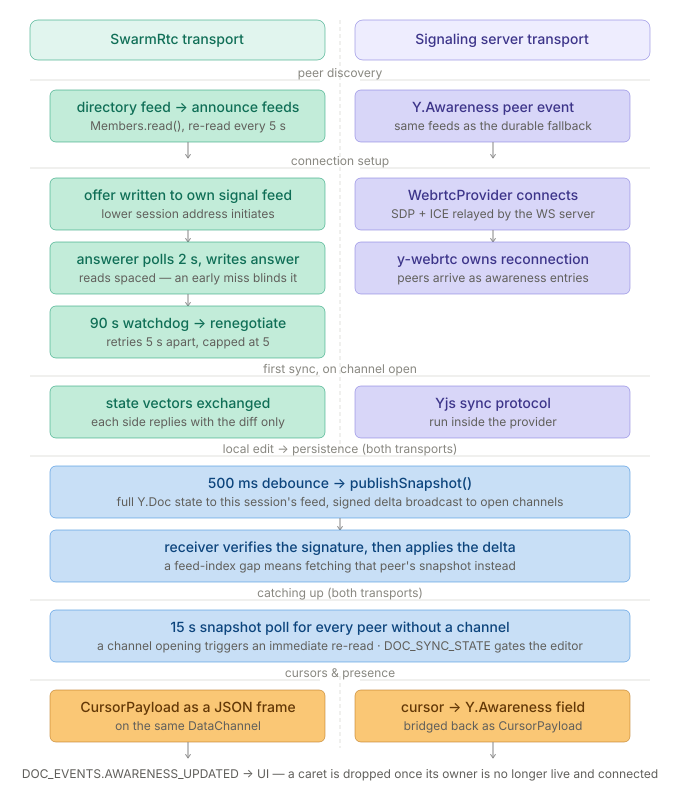

# swarm-collaborative-docs

Serverless, real-time collaborative document editing over [Swarm](https://ethswarm.org).

Each peer writes [Yjs](https://docs.yjs.dev) CRDT snapshots to their own Swarm feed and broadcasts incremental deltas
via a pluggable transport. Late-joining peers recover full document history by fetching Swarm snapshots; online peers
receive low-latency delta notifications. No central server is required for either persistence or synchronisation.

All data written to Swarm is **immutable at the chunk level** — every upload produces a new content address. Feeds are
Swarm's mechanism for publishing a pointer to the latest snapshot; the underlying chunks are never overwritten. This is
a core property of the Swarm network and shapes how this library approaches storage.

---

## How it works

### Data layers

| Layer                  | Mechanism                                    | Purpose                                                            |
| ---------------------- | -------------------------------------------- | ------------------------------------------------------------------ |
| **Document snapshot**  | Per-user Swarm feed (`<topic>_doc<address>`) | Durable, offline-accessible full state                             |
| **Delta notification** | Transport-dependent (see below)              | Fast sync for peers already online                                 |
| **Member discovery**   | Shared Swarm feed (`<topic>_members`)        | One approach to a persistent peer list — alternatives are possible |
| **WebRTC signaling**   | Per-user Swarm feed (`<topic>_signal`)       | SDP exchange without a dedicated signaling server                  |

### Document lifecycle

1. **Init** — each peer reads its own latest snapshot from Swarm and restores local Yjs state.
2. **Member list** — the peer writes itself to the shared consensus feed, then fetches snapshots from all listed peers.
3. **Join announcement** — a `JoinPayload` (`type: 'join'`) is published so online peers know to fetch the new peer's
   snapshot.
4. **Local edits** — Yjs `update` events are debounced, merged into a snapshot, written to the peer's Swarm feed, and
   broadcast as a signed delta via the transport.
5. **Remote updates (delta path)** — when a notification carrying a `delta` arrives, the secp256k1 signature is verified
   and the base64-encoded Yjs update is applied directly — no Swarm read required. Unsigned or invalid deltas are
   dropped.
6. **Remote updates (snapshot path)** — for join events or notifications without a delta, the peer's full snapshot is
   fetched from Swarm with retries.
7. **Cursor awareness** — cursor positions are broadcast on a debounced timer via `CursorPayload` (`type: 'cursor'`) and
   surfaced to subscribers via `DOC_EVENTS.AWARENESS_UPDATED`.

---

## Swarm storage design

### Immutability and feeds

Every piece of data uploaded to Swarm produces a unique, content-addressed chunk that is **immutable by design** — it
cannot be modified or deleted after upload. Swarm feeds are a layer on top of this: a feed is a signed, sequentially
indexed series of pointers, each pointing to a new immutable upload. The feed address is stable; what it points to
changes with each new entry.

This library uses feeds for document snapshots and signaling records. Each time a peer saves a snapshot, a new set of
immutable chunks is uploaded and the feed index is advanced to point at them. Previous snapshots remain accessible at
their original content addresses for as long as the underlying chunks are covered by a valid postage stamp.

### Postage stamps and storage lifetime

Swarm storage is paid for through **postage stamps** — on-chain commitments that authorise uploads and determine how
long chunks persist in the network.

This library's `stamp` setting accepts any postage batch the application provides. How stamps are provisioned, renewed,
and distributed across users is entirely the responsibility of the consuming application. Common patterns include:

- **Per-user stamps** — each user purchases and manages their own stamp. Maximally decentralised; each peer owns their
  data.
- **App-provisioned stamps** — the application provisions a shared stamp and distributes write access. Simpler UX but
  introduces a centralised cost bearer.
- **Sponsored stamps** — a third party (the app operator, a DAO) covers storage costs on behalf of users.

There is no single correct answer — the right model depends on the application's trust assumptions and economic design.

### Member discovery and peer lists

The `<topic>_members` consensus feed used by this library is **one approach** to peer discovery, not a requirement. It
works well for small, known groups where all members write to a shared namespace. Applications are free to replace or
extend it entirely — for example using ENS records, a smart contract registry, a curated invite list, or any other
mechanism that can resolve a set of Ethereum addresses. The `members` field in `DocSettings` accepts a pre-seeded
`Map<address, username>` for exactly this purpose: bring your own discovery layer and hand the resolved peer set to
`SwarmDoc`.

---

## Architecture



## Transport flows



---

## Monaco Editor integration

The example app uses [Monaco Editor](https://github.com/microsoft/monaco-editor) (the VS Code editing engine) as its
primary editor, bound to the shared `Y.Doc` via [`y-monaco`](https://github.com/yjs/y-monaco).

### How it is wired

```
Y.Doc  ──  MonacoBinding (y-monaco)  ──  Monaco ITextModel  ──  editor UI
               │
         awareness map
               │
         deltaDecorations()  ──  remote cursor overlays
```

The `MonacoBinding` keeps the Monaco model and the `Y.Text` in sync bidirectionally. It is created once the `Y.Doc` is
available and destroyed on unmount:

```tsx
const ytext = yDoc.getText(filePathKey) // keyed by file path, default: 'content'

bindingRef.current = new MonacoBinding(
  ytext,
  editor.getModel(),
  new Set([editor]),
  undefined, // awareness passed manually — see below
)
```

### Workers

Monaco spawns Web Workers for language services. Because `vite-plugin-monaco-editor` is incompatible with Vite 6+,
workers are configured manually via `MonacoEnvironment`:

```ts
// src/app/components/MonacoEditor/workers.ts
// import this file before any monaco-editor import
import EditorWorker from 'monaco-editor/esm/vs/editor/editor.worker?worker'
import TsWorker from 'monaco-editor/esm/vs/language/typescript/ts.worker?worker'

window.self.MonacoEnvironment = {
  getWorker(_: unknown, label: string) {
    if (label === 'typescript' || label === 'javascript') return new TsWorker()
    return new EditorWorker()
  },
}
```

### Remote cursor rendering

`y-monaco`'s built-in awareness path is not used here because the library surfaces cursor state through its own
`DOC_EVENTS.AWARENESS_UPDATED` event rather than exposing a `Y.Awareness` instance. Cursors are rendered manually using
Monaco's decoration API:

- `useSwarmDoc` returns `awareness: Map<string, AwarenessState>` — a map of peer address →
  `{ address, username, cursor: { anchor, head } | null }`.
- `MonacoEditor` listens to that map via a `useEffect([awareness])` and calls `editor.deltaDecorations()` on every
  change.
- Peer-specific CSS classes (`.remote-selection-<id>`, `.remote-cursor-head-<id>`) are injected into `<head>` on first
  appearance with a deterministic color derived from the peer's address.
- Local cursor changes are reported back via `onDidChangeCursorSelection` → `updateCursor({ anchor, head })`.

### Multi-file support

Each open file maps to a named `Y.Text` key inside the shared `Y.Doc`:

```ts
yDoc.getText('contracts/MyToken.sol')
yDoc.getText('scripts/deploy.ts')
```

Pass the file path as the `filePathKey` prop to `MonacoEditor`. All open files share the same Swarm transport session —
no extra connections are needed.

---

## Library API (`src/lib`)

### Installation

```bash
npm install @solarpunkltd/swarm-collaborative-docs
```

### `SwarmDoc`

The primary class. Manages a Yjs document backed by Swarm and a pluggable transport.

```typescript
import { SwarmDoc, DocSettings, DOC_EVENTS, createSwarmRtcTransport } from '@solarpunkltd/swarm-collaborative-docs'
import * as Y from 'yjs'

const settings: DocSettings = {
  user: {
    privateKey: '0xabc...', // secp256k1 private key, hex with or without 0x
    nickname: 'Alice',
  },
  infra: {
    beeUrl: 'http://localhost:1633',
    stamp: 'your-postage-batch-id',
    topic: 'my-document-id', // UUID recommended
    transport: createSwarmRtcTransport('stun:stun.l.google.com:19302'),
  },
}

const swarmDoc = new SwarmDoc(settings)

swarmDoc.getEmitter().on(DOC_EVENTS.DOC_UPDATED, (doc: Y.Doc) => {
  /* re-render */
})
swarmDoc.getEmitter().on(DOC_EVENTS.MEMBERS_UPDATED, (members: Map<string, string>) => {
  /* update peer list */
})
swarmDoc.getEmitter().on(DOC_EVENTS.PEERS_CONNECTED, () => {
  /* enable editor */
})
swarmDoc.getEmitter().on(DOC_EVENTS.DOC_ERROR, (err: Error) => {
  /* show error */
})
swarmDoc.getEmitter().on(DOC_EVENTS.AWARENESS_UPDATED, (state: AwarenessState) => {
  /* update cursors */
})

swarmDoc.start()

// bind an editor directly to the shared Y.Text
const text = swarmDoc.doc.getText('content')

// later
swarmDoc.stop()
```

#### Public members

| Member                 | Type            | Description                                                        |
| ---------------------- | --------------- | ------------------------------------------------------------------ |
| `doc`                  | `Y.Doc`         | The shared Yjs document. Bind editors directly to this instance.   |
| `start()`              | `void`          | Starts transport, fetches snapshots, begins member polling.        |
| `stop()`               | `void`          | Tears down transport and all timers.                               |
| `updateCursor(cursor)` | `void`          | Reports local cursor `{ anchor, head }` (or `null`) for broadcast. |
| `getEmitter()`         | `EventEmitter`  | Returns the emitter for `DOC_EVENTS` subscriptions.                |
| `refreshMemberList()`  | `Promise<void>` | Force-reads the consensus member list and registers new peers.     |

### `DocSettings`

```typescript
interface DocSettings {
  user: {
    privateKey: string // secp256k1, hex with or without 0x
    nickname: string
  }
  infra: {
    beeUrl: string // e.g. 'http://localhost:1633'
    stamp?: string // postage batch for all Swarm writes
    topic: string // shared document identifier
    members?: Map<string, string> // pre-seeded peers: Map<address, username>
    transport: DocTransportFactory
  }
}
```

A single postage stamp covers all Swarm writes made by this session: document snapshots, delta notifications, WebRTC
signal records, and the consensus member list. The `stamp` field accepts any valid postage batch — how stamps are
provisioned and managed is left to the application. See
[Swarm postage stamps](https://docs.ethswarm.org/docs/learn/technology/contracts/postage-stamp) for details on capacity
and TTL.

### `DOC_EVENTS`

| Event                          | Payload               | When                                      |
| ------------------------------ | --------------------- | ----------------------------------------- |
| `DOC_EVENTS.DOC_UPDATED`       | `Y.Doc`               | After every remote update is applied      |
| `DOC_EVENTS.DOC_ERROR`         | `Error`               | Stamp validation failure or publish error |
| `DOC_EVENTS.MEMBERS_UPDATED`   | `Map<string, string>` | Peer list changes (address → username)    |
| `DOC_EVENTS.PEERS_CONNECTED`   | `true`                | Transport has at least one connected peer |
| `DOC_EVENTS.AWARENESS_UPDATED` | `AwarenessState`      | Remote cursor position changed            |

`AwarenessState` shape: `{ address: string, username: string, cursor: { anchor: number, head: number } | null }`.

### Interfaces

The library exports TypeScript interfaces for each major class, useful for testing and dependency injection:

| Interface      | Implemented by | Description                                 |
| -------------- | -------------- | ------------------------------------------- |
| `ISwarmDoc`    | `SwarmDoc`     | Public API of the collaborative doc session |
| `IMembers`     | `Members`      | Peer set management and consensus feed      |
| `ISwarmSignal` | `SwarmSignal`  | WebRTC signaling feed reads and writes      |

---

## Transports

Each transport implements `DocTransport` and is passed to `DocSettings.infra.transport` as a factory function. All
transports fall back to Swarm snapshot reads for document history recovery regardless of notification delivery
guarantees.

### `createSwarmPubSubTransport`

> ⚠️ **Experimental** — this transport depends on GSOC ephemeral pubsub, a feature currently available only on a
> development branch of Bee. It is not yet part of a stable Bee release. Expect breaking changes and do not use in
> production.

**Best for**: low-latency real-time notifications over Swarm with no external signaling server, once the underlying Bee
feature is released.

Uses Swarm's GSOC ephemeral pubsub via the Bee node WebSocket endpoint. All peers on the same document topic connect to
the same GSOC address, derived deterministically from the `docFeedId`. Publish calls are buffered during connection and
drained on open. Reconnects automatically after an unexpected WebSocket close.

```typescript
transport: createSwarmPubSubTransport('/ip4/1.2.3.4/tcp/1634/p2p/QmXxxx…')
```

The argument is the multiaddress of a Bee node acting as the GSOC broker. Peer discovery happens via the consensus Swarm
feed and incoming `join` notifications, not at the transport level.

**Delivery**: bidirectional WebSocket push. Messages are ephemeral — offline peers rely on Swarm snapshots.

**Status**: requires a Bee build from the `feat/pubsub` development branch. Not compatible with released Bee versions.

---

### `createSwarmRtcTransport` ✓ recommended

**Best for**: fully decentralised peer-to-peer sync without any external server. This is the recommended transport for
all current use.

SDP offer/answer records are written to and read from each peer's `<topic>_signal` Swarm feed, replacing the traditional
signaling server. Role assignment is deterministic (lower Ethereum address = initiator) to avoid duplicate connections.
On ICE failure the initiator retries automatically.

Yjs binary updates and JSON `NotificationPayload` messages (including cursor) share the same WebRTC DataChannel,
distinguished by message type: binary frames are Yjs updates, string frames are JSON payloads.

```typescript
transport: createSwarmRtcTransport('stun:stun.l.google.com:19302' /* , iceServers? */)
```

**Delivery**: WebRTC DataChannel (peer-to-peer). Requires a Bee node for signaling feed reads/writes.

---

### `createYWebrtcTransport`

**Best for**: low-latency sync in environments where an external WebSocket signaling server is available.

Uses the [y-webrtc](https://github.com/yjs/y-webrtc) library. Peers are discovered via the `Y.Awareness` protocol
through a WebSocket signaling server. Yjs state is synchronised over WebRTC data channels managed by the library.
Cross-tab sync within the same origin is handled automatically via BroadcastChannel.

Cursor state is bridged into the library's `DOC_EVENTS.AWARENESS_UPDATED` event via the awareness `change` handler —
`publish(CursorPayload)` sets `awareness.setLocalStateField('cursor', ...)` and incoming awareness changes are forwarded
to the notification handler as `CursorPayload`.

```typescript
transport: createYWebrtcTransport('wss://your-signaling-server.example' /* , iceServers? */)
```

**Delivery**: WebRTC data channels. Does not require a Bee node for signaling.

---

### `createWakuTransport`

**Best for**: decentralised real-time notifications without a Bee node dependency.

Connects to the [Waku](https://waku.org) network via a libp2p light node using LightPush (send) and Filter (receive)
protocols. Payloads are JSON `NotificationPayload` objects. Node initialisation is asynchronous; calls made before the
node is ready are buffered and drained automatically once both the node is healthy and the filter subscription is
confirmed.

```typescript
transport: createWakuTransport() // Waku default bootstrap
transport: createWakuTransport(['/ip4/...']) // explicit bootstrap peers
```

**Delivery**: gossipsub pub/sub over the Waku network. Messages are ephemeral.

---

## Transport comparison

|                      | SwarmRtc ✓ | yWebrtc | SwarmPubSub ⚠️ | Waku ⚠️ |
| -------------------- | :--------: | :-----: | :------------: | :-----: |
| No external server   |     ✓      |    ✗    |       ✓        |    ✓    |
| Requires Bee node    |     ✓      |    ✗    |       ✓        |    ✗    |
| Requires broker peer |     ✗      |    ✗    |       ✓        |    ✗    |
| Cursor awareness     |     ✓      |    ✓    |       ✓        |    ✓    |
| Cross-device         |     ✓      |    ✓    |       ✓        |    ✓    |
| Offline recovery     |    ✓\*     |   ✓\*   |      ✓\*       |   ✓\*   |
| Production ready     |     ✓      |    ✓    |       ✗        |    ✗    |

\*via Swarm snapshot reads — all transports share the same persistence layer regardless of notification delivery.

**SwarmRtc** is the default and recommended transport. It requires only a standard released Bee node and no external
infrastructure beyond a STUN server.

**SwarmPubSub** requires a Bee build from a development branch and is not yet part of any stable Bee release. The API
may change before release.

**Waku** is functional but delivery reliability depends on the public Waku sandbox network. Not recommended for
production without dedicated bootstrap peers.

---

## Deploying behind a gateway

Some applications serve their frontend through a web gateway rather than having users run a local Bee node directly.
[Remix IDE](https://remix.ethereum.org) is a representative example: it is a web app hosted at a public URL, and its
users access it through a browser without running any local infrastructure.

In this deployment pattern the Swarm persistence layer (snapshot feeds, member list, signal feeds) is accessed via a
**Bee gateway** — a publicly reachable Bee node that the app points its `beeUrl` at. The gateway handles all Swarm reads
and writes on behalf of the user; the user's private key stays in the browser and signs feed updates locally before they
are submitted.

### Transport selection for gateway deployments

The transport choice is constrained by what the hosting application can provide:

**`createYWebrtcTransport` — recommended for gateway-hosted apps**

When the hosting application already runs a WebSocket server (as Remix does for its backend services), that server can
trivially host a [y-webrtc signaling endpoint](https://github.com/yjs/y-webrtc#signaling). This requires adding a single
lightweight signaling handler to the existing server — no separate infrastructure. The signaling server only exchanges
SDP and ICE candidates; no document data passes through it.

```typescript
// the app's existing backend serves the signaling endpoint
transport: createYWebrtcTransport('wss://your-app.example/collab-signal')
```

Peer-to-peer WebRTC data channels are established after signaling, so document content and cursor data flow directly
between peers. Swarm feeds (via the gateway Bee node) provide persistence and offline recovery exactly as in any other
deployment.

**`createSwarmRtcTransport` — works without any server**

If the hosting application cannot provide a signaling server, `SwarmRtcTransport` uses Swarm feeds for SDP exchange via
the gateway Bee node. No additional server is required. The trade-off is higher connection setup latency compared to a
WebSocket signaling server, since SDP negotiation goes through Swarm feed reads and writes.

```typescript
transport: createSwarmRtcTransport('stun:stun.l.google.com:19302')
```

### Gateway deployment architecture

```
Browser (user)
    │
    ├── Swarm reads/writes ──► Bee gateway (public HTTPS)
    │                               │
    │                               └── Swarm network
    │
    └── WebRTC signaling ──► App signaling server (WS)
            │
            └── WebRTC DataChannel (P2P, post-handshake)
                    │
                 Remote peer browser
```

The Bee gateway only needs read access for most peers (fetching member lists and snapshots). Write access (for
publishing snapshots and signal feeds) requires a postage stamp — either the app provisions a shared stamp for all
users, each user provides their own, or another provisioning model is used. See the
[Swarm storage design](#swarm-storage-design) section for the trade-offs.

---

## React hook (`useSwarmDoc`)

Convenience hook for React applications. Manages the `SwarmDoc` lifecycle, re-renders on events, and cleans up on
unmount.

```typescript
import { useSwarmDoc } from './hooks/useSwarmDoc'

const { doc, error, members, connected, awareness, updateCursor, refreshMemberList, dismissError } = useSwarmDoc({
  user,
  infra,
})
```

| Returned value         | Type                          | Description                                 |
| ---------------------- | ----------------------------- | ------------------------------------------- |
| `doc`                  | `Y.Doc \| null`               | The Yjs document (null before init)         |
| `error`                | `Error \| null`               | Latest error, or null                       |
| `members`              | `Map<string, string> \| null` | Connected peers: address → username         |
| `connected`            | `boolean`                     | Whether the transport has at least one peer |
| `awareness`            | `Map<string, AwarenessState>` | Live cursor state per peer address          |
| `updateCursor(cursor)` | `(cursor) => void`            | Reports local cursor position for broadcast |
| `refreshMemberList()`  | `() => void`                  | Triggers an immediate member list refresh   |
| `dismissError()`       | `() => void`                  | Clears the current error                    |

---

## Example app (`src/app`)

A minimal test application demonstrating all transport options with a shared editor.

### Running locally

```bash
pnpm install
pnpm start
```

The app runs at `http://localhost:5002`.

### Login screen

- **Document ID** — UUID identifying the shared document, auto-generated and persisted in `localStorage`. An invite link
  (`?doc=<id>&trans=<transport>`) pre-fills this field.
- **Transport tabs** — select the active notification transport: Swarm PubSub, Waku, or WebRTC (y-webrtc or
  Swarm-based).
- **Advanced settings** (collapsible) — Bee API URL, postage batch ID, broker peer multiaddress (PubSub), signaling
  server URL (WebRTC).

### Session screen

- Shared editor (Monaco or plain textarea fallback) bound to the shared `Y.Text`
- Remote peer cursors rendered as colored overlays with username badges
- Peer list showing connected members (hover for full address, click to copy)
- Transport badge showing the active transport

---

## Future improvements

### Encryption

Currently all document snapshots and deltas are stored and transmitted in plaintext. Anyone with access to the Swarm
feed address and a Bee node can read the content. Two complementary approaches to this problem:

**Client-side encryption** — encrypt the `Y.Doc` snapshot bytes in the browser before uploading to Swarm, and decrypt
after fetching. The encryption key would be derived from a shared secret negotiated between session participants and
never leave the browser. This protects content at rest from any observer with access to the Swarm network, including the
Bee gateway operator.

**Swarm ACT (Access Control Trie)** — Swarm's native access control layer allows uploads to be encrypted such that only
designated grantees can decrypt them, with access managed on-chain via a publisher/history address scheme. Integrating
ACT would allow document access to be granted and revoked per-peer without re-encrypting the full history, and makes
encryption verifiable at the storage layer rather than relying solely on application-level key management.

These two approaches are not mutually exclusive — client-side encryption provides an additional layer of protection for
content in transit and at rest locally, while ACT governs who can decrypt content retrieved from Swarm.

---

### Wallet-based identity and decoupled user keys

The current implementation derives the user's identity from a raw secp256k1 private key passed directly to
`DocSettings.user.privateKey`. This couples the user's signing key to the application and requires the application to
manage key material directly — a security risk and a poor user experience.

Possible improvements:

**Wallet connection** — instead of accepting a raw private key, the library would accept any
[EIP-1193](https://eips.ethereum.org/EIPS/eip-1193)-compatible provider (MetaMask, WalletConnect etc.). The user's
Ethereum account would be used for signing feed updates and delta payloads without the private key ever being exposed to
the application. This also gives users a consistent identity across applications — the same Ethereum address they use
for on-chain interactions identifies them in collaborative sessions.

```typescript
const settings: DocSettings = {
  user: {
    provider: window.ethereum, // any EIP-1193 provider, replaces privateKey
    nickname: 'Alice',
  },
  ...
}
```

**Decoupled identity from the Bee node** — currently the library's signing key is implicitly tied to the Bee node
configuration. Separating user identity from the Bee node means a user can point the application at any Bee gateway
(their own, a public one, or an app-provisioned one) without that gateway having any relationship to their Ethereum
identity. Feed updates would be signed client-side and submitted to whichever node the application is configured with.

**Session keys** — for applications where users should not sign every feed update with their main wallet key, a
delegated session key (an ephemeral key authorised by a one-time wallet signature) could be used for the duration of a
session. The main wallet key establishes identity; the session key handles the high-frequency signing required for
real-time edits.

## License

[Apache-2.0](./LICENSE)
